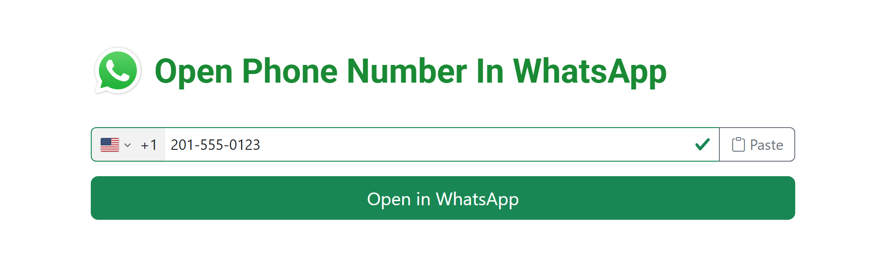

<div align="center">


# Whatsphone

**Message any phone number on WhatsApp — without saving it to your contacts first.**

[](https://whatsphone.github.io/)

[](LICENSE)
[](index.html)
[](#-how-it-works)
[](https://whatsphone.github.io/)



</div>

---

## 😖 The problem

WhatsApp won't let you message a number that isn't in your address book. So you save "Plumber (maybe)" to your contacts, send one message, and never clean it up.

**Whatsphone skips that.** Paste a number, tap once, you're in the chat. Nothing is saved anywhere.

## ✨ Features

| | |
|---|---|
| 🌍 | **Automatic country detection** — your country and dial code are pre-selected from your IP |
| ✅ | **Live validation** — real carrier numbering rules, so you know it'll work before you tap |
| 📋 | **One-tap paste** — grab a number straight from your clipboard |
| 🔗 | **URL shortcuts** — pre-fill or jump straight to a chat from a link or bookmark |
| 📱 | **Works everywhere** — one static page, mobile and desktop, no install |
| 🔒 | **No accounts, no tracking, no storage** — your number never leaves your browser |

## 🚀 Usage

Open **[whatsphone.github.io](https://whatsphone.github.io/)**, type or paste a number, and tap **Open in WhatsApp**.

### URL shortcuts

Append the number to the URL to skip steps entirely — handy for bookmarks, scripts, and shortcuts.

| Shortcut | What it does | Example |
|---|---|---|
| `#` + number | Pre-fills the field, then you tap the button | [`whatsphone.github.io#+15551234567`](https://whatsphone.github.io/#+15551234567) |
| `##` + number | Opens the WhatsApp chat immediately | [`whatsphone.github.io##+15551234567`](https://whatsphone.github.io/##+15551234567) |

> [!TIP]
> The country code is optional if the number is in the same country as your IP address — `#5551234567` works too.

Formatting is forgiving: spaces, dashes, brackets and a `00` international prefix are all cleaned up automatically, so `#00 33 (0)6 12 34 56 78` works fine.

## 🔍 How it works

A single self-contained [`index.html`](index.html) — no build step, no framework, no backend.

1. **Country detection** asks a geolocation API for your ISO country code, then caches it in a cookie for 24 hours. Three providers are tried in order, so one being down or rate-limited doesn't break detection.
2. **Validation and formatting** use [intl-tel-input](https://github.com/jackocnr/intl-tel-input) bundled with Google's libphonenumber rules.
3. **The link** is a plain [`wa.me`](https://wa.me/) URL built from the number in E.164 form.

Every third-party asset is version-pinned and protected with [Subresource Integrity](https://developer.mozilla.org/en-US/docs/Web/Security/Subresource_Integrity), so a compromised CDN can't inject code into the page.

## 🛠️ Running it locally

No toolchain required — it's one static file.

```bash
git clone https://github.com/whatsphone/whatsphone.github.io.git
cd whatsphone.github.io
python3 -m http.server 8000   # or: npx serve
```

Then open <http://localhost:8000>.

## 🤝 Contributing

Issues and pull requests are welcome. Since there's no build step, the whole app is [`index.html`](index.html) — edit it, open it in a browser, done.

## 📄 License

[MIT](LICENSE) © whatsphone

<div align="center">
<sub>Not affiliated with WhatsApp or Meta. WhatsApp is a trademark of Meta Platforms, Inc.</sub>
</div>
